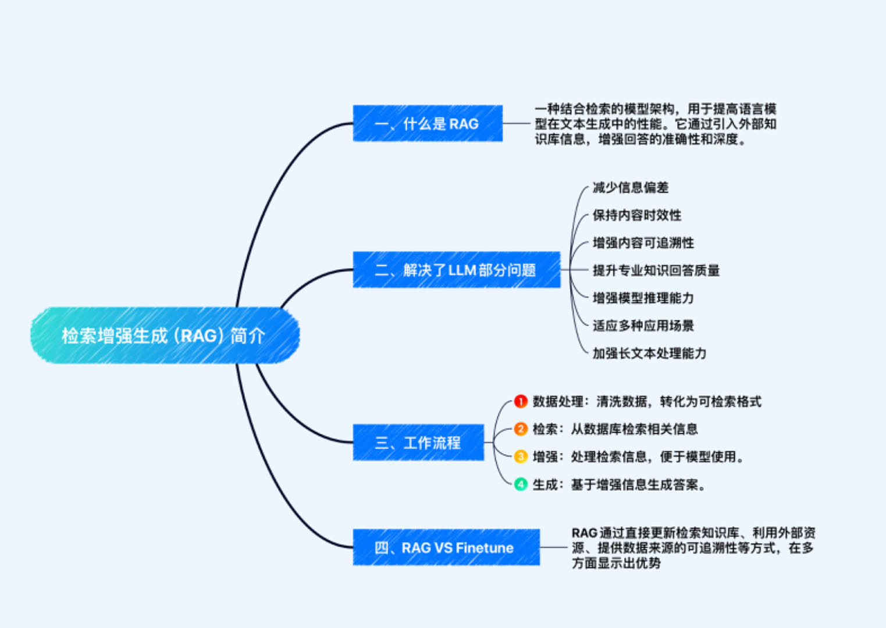
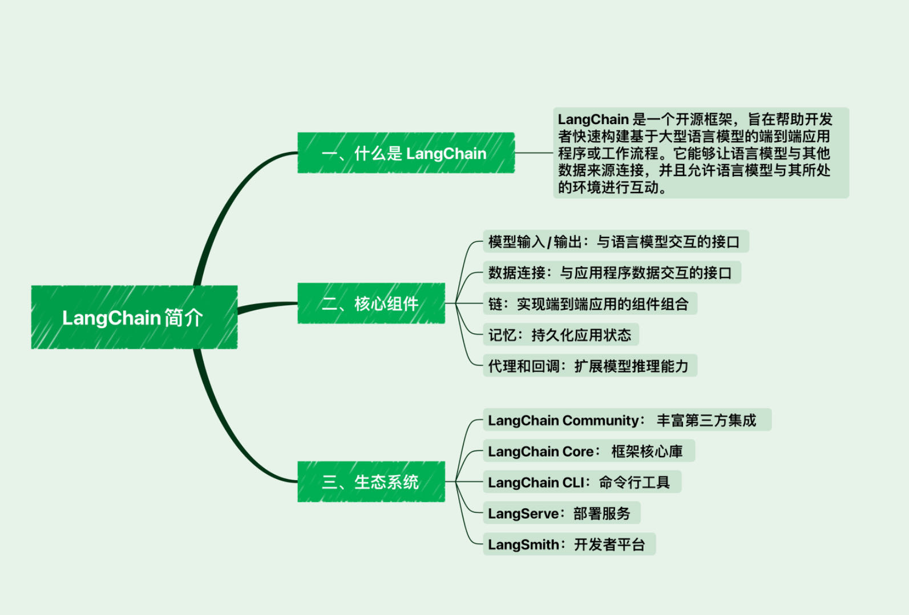

# 一、大型语言模型（LLM）理论简介 

大型语言模型（LLM）是旨在理解和生成人类语言的人工智能模型。它们包含数百亿（或更多）参数，并在海量文本数据上进行训练，以深层次地理解语言。知名的 LLM 包括 GPT-3.5、GPT-4、PaLM、Claude 和 LLaMA 等。这些模型展现了在解决复杂任务时的惊人潜力，尤其是 ChatGPT 展示出了与人类交流的自然流畅性。

## 什么是大型语言模型（LLM） 

### 概念
- LLM 通常指拥有数百亿参数的语言模型。
- 在大量文本数据上训练，以获得对语言的深层理解。

### 发展历程
- 研究可追溯至 20 世纪 90 年代，最初集中在统计学习方法。
- 2003 年，深度学习被引入语言模型，标志性的是 Bengio 的论文。
- Transformer 架构的崛起（2018 年左右）极大提升了模型性能。
- 模型规模的扩大展现了惊人的“涌现能力”。

### 常见模型
- GPT 系列：由 OpenAI 提出，特点是通过语言建模压缩世界知识。
- Claude 系列：由 Anthropic 公司开发，致力于提升模型的理解和生成能力。
- PaLM/Gemini 系列：由 Google 开发，PaLM 是早期模型，Gemini 是后续升级版本。
- 文心一言：基于百度文心大模型，中文能力强。
- 星火大模型：科大讯飞发布，支持多种自然语言处理任务。
- LLaMA 系列：Meta 开源的基础语言模型，强调使用公开数据集训练。
- 通义千问：阿里巴巴基于“通义”大模型研发的开源模型。

（该图来源于[Awesome-Multimodal-Large-Language-Models](https://github.com/BradyFU/Awesome-Multimodal-Large-Language-Models?tab=readme-ov-file)）

## LLM 的能力与特点 
- 涌现能力：大型模型在解决复杂任务时表现出的潜力。
- 对话式应用：如 ChatGPT，展现出自然和流畅的交流能力。
- 多模态理解：如 GPT-4，扩展到理解多种形式的输入。
- 安全性和可靠性：通过迭代训练和安全奖励信号提高响应的安全性。

## LLM 的应用与影响 
- 知识探索与生成：通过深层理解语言，LLM 能生成内容，解决问题。
- 自然语言交互：提升人机交互的自然度和流畅性。
- 教育和研究：辅助学习和研究，提供丰富的信息和解答。
- 商业应用：从文本生成到客户服务，LLM 正在变革多个行业。

> ## 问题&思考❓
>
>  **大型语言模型（LLM）作为概率模型是否能实现通用人工智能（AGI）？** 
>
> - **AGI 的定义和追求**：AGI 旨在创建能够在广泛认知任务上与人类相当或更优的人工智能系统。目前，多个研究机构和公司正在朝这一目标努力。[Wikipedia. Artificial general intelligence](https://en.wikipedia.org/wiki/Artificial_general_intelligence)
>
> - **涌现能力**：一个复杂系统（如AGI）可能在微观层面上充满不确定性和概率性，但在宏观层面上展现出明确的智能和逻辑。LLM在处理统计归纳和因果推理时展现出的涌现能力，展现了量变到质变的过程，以及在足够复杂度和数据量下，模型可能会“顿悟”出超越其训练数据的本质规律。
>
> - **大型语言模型与智能系统特征**：智能行为有许多特征。例如，理解世界的能力、理解物理世界的能力、记忆和检索事物的能力、持久性记忆、推理能力和计划能力。这是智能系统或实体、人类、动物的四个基本特征。LLM 无法做到这些，或者只能以非常原始的方式做到这些，而且并不真正了解物理界。LLM 并没有真正的持久记忆，无法真正推理，当然也无法计划。因此，如果你期望系统变得智能，但却无法做这些事情，那么你就犯了一个错误。这并不是说自回归 LLM 没有用。它们当然有用，但它们并不有趣，我们无法围绕它们构建整个应用程序生态系统。但作为迈向人类水平智能的通行证，它们缺少必要的组成部分。
> 通过感官输入，我们看到的信息比通过语言看到的信息多得多，尽管我们有直觉，但我们学到的大部分内容和知识都是通过我们的观察和与现实世界的互动，而不是通过通过语言。我们在生命最初几年学到的一切，当然还有动物学到的一切，都与语言无关。
> [Yann Lecun: Meta AI, Open Source, Limits of LLMs, AGI & the Future of AI | Lex Fridman Podcast](https://link.zhihu.com/?target=https%3A//youtu.be/5t1vTLU7s40%3Ffeature%3Dshared)
> - **多语言能力**：对于同样的问题，如果 LLM 的前置回复显示其已经完全理解问题，会发现使用英文提问时其给出的回复较优。而如果是人类理解了一个问题后，那么不管提问的语言是什么，都会给出类似的回复。当然也不排除这是因为目前 LLM 的参数数量无法达到人脑水平。

# 二、检索增强生成（RAG）简介

# 三、LangChain简介

利用 LangChain 框架，可以轻松地构建如下所示的 RAG 应用（[图片来源](https://github.com/chatchat-space/Langchain-Chatchat/blob/master/img/langchain+chatglm.png)）

# 四、开发 LLM 应用的整体流程

## 1. 大模型开发简介
大模型开发是指开发以大语言模型(LLM)为功能核心的应用，通过大语言模型的理解能力和生成能力，结合特定的数据或业务逻辑来提供独特功能。技术核心点在于通过调用API或开源模型实现理解与生成，通过Prompt Engineering实现大语言模型的控制。

### 大模型开发要素
- **指令遵循与文本生成：** 提供了替代复杂业务逻辑的简单平替方案。
- **Prompt Engineering：** 用于替代传统AI开发中的子模型训练，简化业务逻辑实现。
- **评估思路：** 大模型开发流程更灵活，从业务需求出发构造小批量验证集，设计合理Prompt，进行优化。

## 2. 大模型开发的一般流程
1. **确定目标：** 明确开发目标，包括应用场景、目标人群、核心价值。
2. **设计功能：** 设计应用所提供的功能及每个功能的实现逻辑。
3. **搭建整体架构：** 基于特定数据库+Prompt+通用大模型的架构，实现从用户输入到应用输出的全流程贯通。
4. **搭建数据库：** 构建个性化数据库以支持大模型应用，包括数据收集、预处理、向量化存储等。
5. **Prompt Engineering：** 构建优质的Prompt，逐步迭代优化以提升应用性能。
6. **验证迭代：** 通过不断发现Bad Case并优化Prompt Engineering来提升系统效果。
7. **前后端搭建：** 完成核心功能后，进行前后端开发，设计产品页面。
8. **体验优化：** 应用上线后进行用户体验跟踪，记录反馈并进行优化。

## 3. 搭建 LLM 项目的流程简析（[以知识库助手为例](https://github.com/logan-zou/Chat_with_Datawhale_langchain)）
1. **项目规划与需求分析：** 明确项目目标、核心功能、技术架构等。
2. **数据准备与向量知识库构建：** 包括文档收集、向量化、知识库索引建立等。
3. **大模型集成与API连接：** 集成不同大模型，配置API。
4. **核心功能实现：** 构建Prompt Engineering，实现大模型回答功能。
5. **核心功能迭代优化：** 收集Bad Case，迭代优化核心功能。
6. **前端与用户交互界面开发：** 使用Gradio和Streamlit搭建前端界面，设计用户界面。
7. **部署测试与上线：** 部署应用到服务器或云平台，确保稳定性，进行上线。
8. **维护与持续改进：** 监测系统性能和用户反馈，定期更新知识库和系统改进。

# 五、开发环境配置(已提交至课程项目)
[参考链接](https://github.com/datawhalechina/llm-universe/blob/main/docs/C1/7.GitHub%20Codespaces%20%E7%9A%84%E5%9F%BA%E6%9C%AC%E4%BD%BF%E7%94%A8.md)
