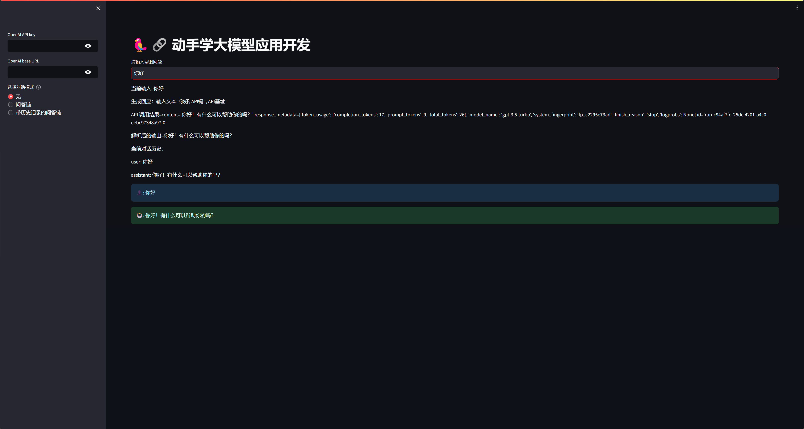

# 一、LLM接入LangChain
[LangChain官方文档](https://python.langchain.com/docs/get_started/introduction)

## 实际操作
1. **调用 LLM**:
   - 通过 LangChain，可以方便地调用 LLM 并集成到个人应用中。

2. **Prompt 模板**:
   - 在开发大模型应用时，通常不会直接将用户输入传递给LLM。而是通过提示模板添加更多上下文，这些模板转化用户输入为完全格式化的提示，辅助模型更好地理解和响应。

3. **输出解析器**:
   - OutputParsers 负责将语言模型的输出转换为可用格式，比如 JSON 或字符串，这对于整合模型输出到应用中非常关键。

  
# 二、构建检索问答链


# 三、部署知识库助手
[streamlit官方文档](https://docs.streamlit.io/)

修改UI，部署成功！


代码

```python
import streamlit as st
from langchain_openai import ChatOpenAI
import os
from langchain_core.output_parsers import StrOutputParser
from langchain.prompts import PromptTemplate
from langchain.chains import RetrievalQA
import sys
sys.path.append("../C3_搭建知识库")
__import__('pysqlite3')
sys.modules['sqlite3'] = sys.modules.pop('pysqlite3')
from zhipuai_embedding import ZhipuAIEmbeddings
from langchain.vectorstores.chroma import Chroma
from langchain.memory import ConversationBufferMemory
from langchain.chains import ConversationalRetrievalChain
from dotenv import load_dotenv, find_dotenv
_ = load_dotenv(find_dotenv())

openai_api_key = os.environ["OPENAI_API_KEY"]
openai_base_url = os.environ["OPENAI_BASE_URL"]

def generate_response(input_text, openai_api_key, openai_api_base):
    st.write(f"生成回应：输入文本={input_text}, API键={openai_api_key}, API基址={openai_api_base}")  # 调试输出
    llm = ChatOpenAI(temperature=0.7, openai_api_key=openai_api_key, openai_api_base=openai_api_base)
    output = llm.invoke(input_text)
    st.write(f"API 调用结果={output}")  # 调试输出
    output_parser = StrOutputParser()
    output = output_parser.invoke(output)
    st.write(f"解析后的输出={output}")  # 调试输出
    return output

def get_vectordb():
    st.write("获取向量数据库")  # 调试输出
    embedding = ZhipuAIEmbeddings()
    persist_directory = '../C3_搭建知识库/data_base/vector_db/chroma'
    vectordb = Chroma(persist_directory=persist_directory, embedding_function=embedding)
    st.write(f"已加载向量数据库：持久化目录={persist_directory}")  # 调试输出
    return vectordb

def get_chat_qa_chain(question, openai_api_key, openai_api_base):
    st.write(f"获取带历史记录的问答链：问题={question}")  # 调试输出
    vectordb = get_vectordb()
    llm = ChatOpenAI(model_name="gpt-3.5-turbo", temperature=0, openai_api_key=openai_api_key, openai_api_base=openai_api_base)
    if 'memory' not in st.session_state:
        st.session_state.memory = ConversationBufferMemory(memory_key="chat_history", return_messages=True)
        print(1)
    retriever = vectordb.as_retriever()
    qa = ConversationalRetrievalChain.from_llm(llm, retriever=retriever, memory=st.session_state.memory)
    result = qa.invoke({"question": question})
    st.write(f"问答链结果={result}")  # 调试输出
    return result['answer']

def get_qa_chain(question, openai_api_key, openai_api_base):
    st.write(f"获取问答链：问题={question}")  # 调试输出
    vectordb = get_vectordb()
    llm = ChatOpenAI(model_name="gpt-3.5-turbo", temperature=0, openai_api_key=openai_api_key, openai_api_base=openai_api_base)
    template = """使用以下上下文来回答最后的问题。如果你不知道答案，就说你不知道，不要试图编造答
        案。最多使用三句话。尽量使答案简明扼要。总是在回答的最后说“谢谢你的提问！”。
        {context}
        问题: {question}
        """
    QA_CHAIN_PROMPT = PromptTemplate(input_variables=["context","question"],
                                 template=template)
    qa_chain = RetrievalQA.from_chain_type(llm,
                                       retriever=vectordb.as_retriever(),
                                       return_source_documents=True,
                                       chain_type_kwargs={"prompt":QA_CHAIN_PROMPT})
    result = qa_chain.invoke({"query": question})
    st.write(f"问答链调用结果={result}")  # 调试输出
    return result["result"]


def main():
    st.set_page_config(page_title="大模型应用开发", layout="wide")
    st.title('🦜🔗 动手学大模型应用开发')

    if 'messages' not in st.session_state:
        st.session_state.messages = []
        st.write("初始化对话历史")  # 调试输出

    openai_api_key = st.sidebar.text_input('OpenAI API key', type='password')
    openai_base_url = st.sidebar.text_input('OpenAI base URL', type='password')
    selected_method = st.sidebar.radio(
        "选择对话模式",
        ["无", "问答链", "带历史记录的问答链"],
        help="选择您希望的问答模式。"
    )

    prompt = st.text_input("请输入您的问题：", key="user_input")
    st.write(f"当前输入: {prompt}")  # 调试输出

    if prompt:
        if not any(m['text'] == prompt for m in st.session_state.messages if m['role'] == 'user'):
            st.session_state.messages.append({"role": "user", "text": prompt})
            if selected_method == "无":
                answer = generate_response(prompt, openai_api_key, openai_base_url)
            elif selected_method == "问答链":
                answer = get_qa_chain(prompt, openai_api_key, openai_base_url)
            elif selected_method == "带历史记录的问答链":
                answer = get_chat_qa_chain(prompt, openai_api_key, openai_base_url)

            if answer:
                st.session_state.messages.append({"role": "assistant", "text": answer})
        else:
            st.write("输入重复，未添加到历史")  # 调试输出

    st.write("当前对话历史：")  # 调试输出
    for message in st.session_state.messages:
        st.write(f"{message['role']}: {message['text']}")  # 调试输出

    messages_container = st.container()
    with messages_container:
        for message in st.session_state.messages:
            if message["role"] == "user":
                st.info(f"👤: {message['text']}")
            elif message["role"] == "assistant":
                st.success(f"🤖: {message['text']}")

if __name__ == "__main__":
    main()

```