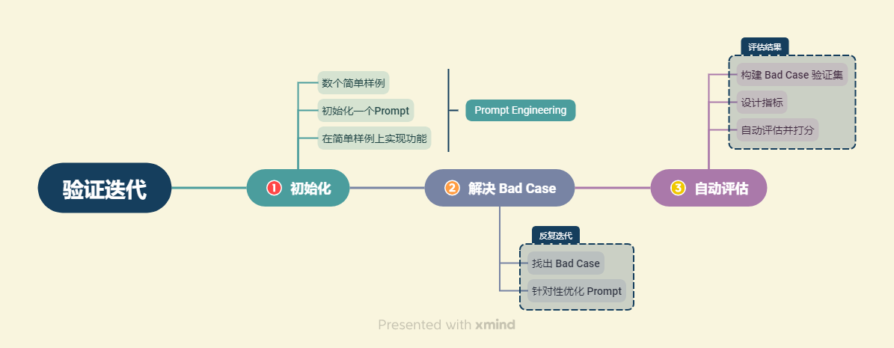

# 一、如何评估LLM应用

> **讨论 LLM 开发过程中如何进行应用评估。特别强调了验证迭代的重要性以及在没有明确答案的情况下如何评估模型性能。**

## 验证评估的一般思路
在LLM应用开发中，验证评估是一个关键步骤，主要包括以下几个方面：

- **快速迭代**：利用LLM快速构建基于少数样本的应用，并进行迭代优化。
- **逐步添加测试样本**：开始可能只有几个样本，但随着时间推移，会增加更多难以处理的样本到测试集中。
- **性能指标定义**：定义如平均准确度等性能指标来衡量模型在小样本集上的表现。


## 大模型评估方法
在具体实施中，模型评估通常涉及以下几个步骤：
1. 识别Bad Cases：找出模型处理不好的案例，并进行针对性优化。
2. 人工评估与自动评估：初始阶段可能依赖人工评估，但随着数据集的增大，需要转向自动化评估。
### 评估维度
- 知识查找正确性：检查模型找到的知识片段是否能够准确回答问题。
- 回答一致性和正确性：评估模型的回答是否一致、准确无误。
- 逻辑性与通顺性：确保回答逻辑连贯，表达通顺。

```python
from langchain.prompts import PromptTemplate
from langchain.chains import RetrievalQA

template_v1 = """..."""
template_v2 = """..."""

QA_CHAIN_PROMPT = PromptTemplate(input_variables=["context","question"], template=template_v1)
qa_chain = RetrievalQA.from_chain_type(llm, retriever=vectordb.as_retriever(), return_source_documents=True, chain_type_kwargs={"prompt":QA_CHAIN_PROMPT})

question = "南瓜书和西瓜书有什么关系？"
result = qa_chain({"query": question})
print(result["result"])
```
### 自动化评估的实现

随着测试集的增大，需要实现自动化的评估流程，以便快速、准确地评估模型性能

#### 1.使用BLEU评分方法计算相似度
```python
from nltk.translate.bleu_score import sentence_bleu
import jieba

def bleu_score(true_answer, generate_answer):
    true_answers = list(jieba.cut(true_answer))
    generate_answers = list(jieba.cut(generate_answer))
    return sentence_bleu([true_answers], generate_answers)

true_answer = '...'
generate_answer = '...'
print(bleu_score(true_answer, generate_answer))
```

#### 2.使用大模型进行评估
利用大模型的能力，可以模拟人工评估的过程，提供快速且低成本的评估结果，但存在准确性不足、评估不够全面的问题

#### 3.混合评估
混合评估结合了人工评估和自动评估的优点，针对不同的需求和情况选择最合适的评估方法

# 二、评估并优化生成部分

## 创建基于模板的检索链

```python
from langchain.prompts import PromptTemplate
from langchain.chains import RetrievalQA

template_v1 = """使用以下上下文来回答最后的问题。如果你不知道答案，就说你不知道，不要试图编造答案。最多使用三句话。尽量使答案简明扼要。总是在回答的最后说“谢谢你的提问！”。
{context}
问题: {question}
"""

QA_CHAIN_PROMPT = PromptTemplate(input_variables=["context", "question"], template=template_v1)
qa_chain = RetrievalQA.from_chain_type(llm, retriever=vectordb.as_retriever(), return_source_documents=True, chain_type_kwargs={"prompt":QA_CHAIN_PROMPT})

question = "什么是南瓜书"
result = qa_chain({"query": question})
print(result["result"])
```

## 分析和优化答案
- 提升直观回答质量
- 标明知识来源，提高可信度
- 构造思维链
- 增加一个指令解析

# 三、评估并优化检索部分

> 在构建基于 RAG 框架的大模型应用时，检索部分的优化至关重要。这一部分确保我们能够准确地从知识库中检索到与用户查询相关的内容。以下是
> 如何评估和优化检索部分的基本思路。

## 评估检索效果

检索部分的核心任务是找到可以准确回答用户查询的文本段落。如下图所示，系统需要将用户的查询转换为向量，并在向量数据库中匹配到最相关的文本段。


### 1.定义准确率

为了评估检索效果，可以采用以下准确率定义：

- 对于 N 个给定的查询，确保每个查询的正确答案都在知识库中。
- 假设每个查询检索到 K 个文本片段，若正确答案在这些片段中，则视为检索成功。
- 系统的检索准确率计算公式为：$$accuracy = \frac{M}{N}$$ 其中 M 是成功检索的查询数量。

通过这种方法，我们可以量化检索部分的表现，并确定需要进一步优化的方向。

### 2.检索部分的挑战

尽管上述方法简单直观，但存在一些挑战：

- 对于需要联合多个知识片段才能回答的查询，该如何评估？
- 知识片段的排序可能会影响到大模型的生成结果，应不应该考虑排序效果？
- 应尽量避免检索到误导性的知识片段，以防误导大模型。

## 优化检索的思路


